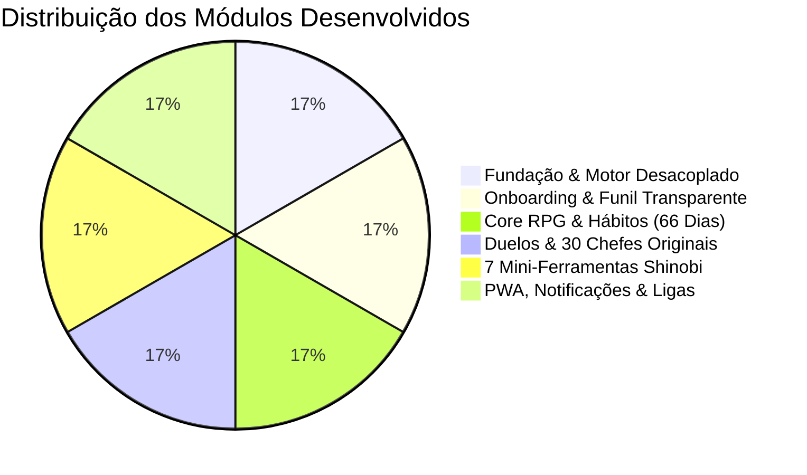

# 🗺️ ROADMAP DO PROJETO — MAKING LEGENDS
> **Versão:** 1.0.0  
> **Status Geral:** 🟢 Versão Completa e Forjada  
> **Tema:** Shinobi Gamified RPG (Original Lore)  
> **Protocolo Central:** 66 Dias de Formação de Hábitos (UCL / Phillippa Lally)

Este documento atua como o registro mestre de estado, marcos de desenvolvimento e especificações funcionais do **Making Legends**.

---

## 📊 Visão Geral dos Módulos e Progresso

---

## 🧭 Fases de Implementação Concluídas

### 🧱 FASE 1: Fundação, Arquitetura & Motor Desacoplado
- [x] **1.1 Setup do Projeto:** React 19 + Vite + TypeScript + Tailwind CSS + Lucide Icons + Canvas Confetti + Web Audio API.
- [x] **1.2 Motor de Temas Desacoplado:** `src/theme/types.ts` e `src/theme/shinobi.theme.ts` isolando todo o vocabulário Shinobi da lógica RPG matemática para permitir futuros temas sem reescrita de código.
- [x] **1.3 Arquitetura de Estado & Offline-First:** Zustand com persistência local e Dexie.js (IndexedDB).
- [x] **1.4 Design System Shinobi:** Paleta Índigo Profundo (`#0a0c12`), Carmesim (`#e11d48`), Ouro Antigo (`#eab308`), Ciano Chakra (`#06b6d4`) e Jade (`#10b981`), sombras de chakra e tipografia Cinzel/Inter.

### 📜 FASE 2: Onboarding, Avaliação de Aptidão & Funil Transparente
- [x] **2.1 Quiz de Admissão da Academia:** 6 etapas avaliando rotina, nível de distração, prática de atividade física, leitura, maior obstáculo e nome shinobi.
- [x] **2.2 Gerador do Pergaminho de Missão:** Algoritmo que sintetiza o programa sob medida de 66 dias com distribuição nos 5 pilares antes de qualquer cobrança.
- [x] **2.3 Paywall Transparente & Prévia:** Preços claros visíveis desde o início (Mensal e Anual com 50% de economia), 7 dias de teste grátis e opção de plano gratuito com 3 missões.

### ⚡ FASE 3: Motor de Hábitos, Atributos & Protocolo 66 Dias
- [x] **3.1 Os 5 Pilares de Atributos:**
  - *Taijutsu (Corpo)*: treino físico, postura, atividade.
  - *Ninjutsu (Mente)*: leitura, estudo, retenção de conhecimento.
  - *Controle de Chakra (Disciplina)*: constância, rotina inegociável, cumprimento de prazos.
  - *Espírito (Confiança)*: superação, coragem, autoconfiança.
  - *Genjutsu (Foco)*: deep work, concentração imersiva, meditação.
- [x] **3.2 Sistema de Missões Diárias (Rank E a S):** Criação, edição, exclusão e checklist com atribuição de XP por pilar, momento do dia e tempo estimado.
- [x] **3.3 Protocolo 66 Dias (Phillippa Lally / UCL):**
  - *Fase 1: Despertar (Dias 1–22)*
  - *Fase 2: Forja (Dias 23–44)*
  - *Fase 3: Mestria (Dias 45–66)*
  - Mecânica de "Escudo de Chakra Semanal" (1 tolerância científica de falha por semana sem zerar a sequência).
- [x] **3.4 Ranks & Curva Não-Linear de XP:** Aspirante de Academia → Genin → Chunin → Jonin → Anbu → Sannin → Kage.
- [x] **3.5 Pergaminho de Status:** Gráfico de Radar SVG dos 5 pilares, relíquias ativas e histórico de evolução.
- [x] **3.6 Modo Elite (Treino Extremo):** Penalidades estritas e desativação do escudo de chakra para quem busca disciplina máxima.

### 🥷 FASE 4: Modo Duelo (Boss Battles) & Equipamentos Funcionais
- [x] **4.1 Customizador de Avatar:** 5 silhuetas, 4 trajes, 4 testeiras/máscaras e 5 auras de ressonância de chakra.
- [x] **4.2 Banco de 30 Adversários 100% Originais:** Fichas completas de chefes com lore, fraquezas de pilar (+35% de dano) e drops de relíquias.
- [x] **4.3 Mecânica de Batalha Diária:** XP acumulado no dia converte-se em dano à barra de vida do oponente com chance de acertos críticos.
- [x] **4.4 Itens & Relíquias com Efeito Real:** Equipamentos que aplicam multiplicadores reais de XP (+15% a +40%), escudos extras e bônus de dano.

### 🛠️ FASE 5: As 7 Mini-Ferramentas Shinobi
- [x] **5.1 Diário de Nutrição do Guerreiro:** Registro alimentar rápido de calorias e proteínas com barras de meta diária.
- [x] **5.2 Técnica de Concentração (Pomodoro):** Modos 25min e 50min com som de Sino Zen Solfeggio 528Hz e contagem de sessões (+60 XP Genjutsu).
- [x] **5.3 Pergaminhos de Conhecimento (Resumos IA):** Sínteses práticas de *Hábitos Atômicos*, *Deep Work*, *Mindset* e *Nada Pode Me Ferir*.
- [x] **5.4 Meditação do Chakra:** Respiração tática 4-4-4-4 (Inspire, Segure, Expire, Vazio) com animação visual de expansão de energia.
- [x] **5.5 Selo de Bloqueio:** Assistente de compromisso digital e barreira de foco (+30 XP Chakra).
- [x] **5.6 Registro de Treinamento (Taijutsu):** Logger de séries, repetições, exercícios e categorias (+40 XP Taijutsu).
- [x] **5.7 Diário do Corpo:** Contador visual de copos d'água (250ml) e registrador de sono com nota por estrelas.

### 🏆 FASE 6: Social, Ligas, Colecionáveis & Gamificação
- [x] **6.1 Pergaminhos de Ensinamento:** Cartões motivacionais colecionáveis associados aos 5 pilares com conselho e ação prática.
- [x] **6.2 Ligas & Temporadas:** Liga Prata III com ranking semanal de pontuação entre companheiros.

### 📱 FASE 7: PWA, Notificações Push & Polimento Mobile
- [x] **7.1 PWA Completo:** Web App Manifest e Service Worker offline via Workbox.
- [x] **7.2 Notificações Customizáveis:** Ajuste livre dos horários de abertura matinal e fechamento noturno desde o primeiro dia.
- [x] **7.3 Onboarding Guiado iOS Safari:** Modal passo a passo para instalação na tela inicial do iPhone.

---

## 🔒 Checklist de Conformidade com Regras de IP

- [x] Nomes de personagens protegidos banidos (0% de ocorrência).
- [x] Nomes de vilas protegidas banidos (0% de ocorrência).
- [x] Técnicas proprietárias banidas (0% de ocorrência).
- [x] Paleta própria: Índigo Noturno, Carvão, Carmesim, Ouro e Jade.
- [x] 30 Chefes de Duelo e lore 100% originais.
- [x] Vocabulário genérico de folclore ninja utilizado com estrita conformidade legal.
